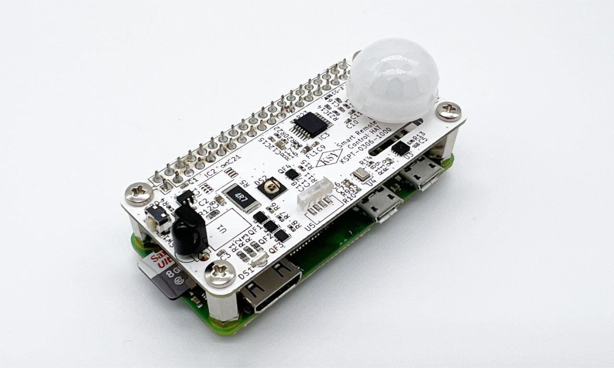

node-ksy-hat
===============

node-ksy-hat は KSY 社の Raspberry Pi 向けマルチセンサー HAT「[Smart Remote Control HAT](https://raspberry-pi.ksyic.com/main/index/pdp.id/856,847,835,836/pdp.open/856)」を制御および計測値を取得するモジュールです。



<span style="font-size:90%;">※ このモジュールは KSY 社公式または公認の node モジュールではありません。非公式・非公認の node モジュールです。</span>

このモジュールは以下の機能を提供します。

- マルチカラー LED の操作
- パワー赤外発光ダイオードの操作
- タクトスイッチの状態変化検知
- 焦電センサ (モーションセンサ) の状態変化検知
- 温湿度センサ (Sensirion SHT30) の計測値取得
- 環境光センサ (VISHAY VEML7700-TT) の計測値取得
- 絶対圧センサ (オムロン 2SMPB-02E) の計測値取得

本モジュールは、現時点では以下の機能は提供していません。

- 赤外リモコン受光モジュール (VISHAY TSOP38238)

## サポート OS

node-ksy-hat は、Raspberry Pi OS で動作します。

## 依存関係

* [Node.js](https://nodejs.org/en/) 18 以上
    * node v18 より前のバージョンでも動作するはずですが、テストしていませんので、サポート対象外とします。
* [rpi-gpio](https://github.com/JamesBarwell/rpi-gpio.js)
* [i2c-bus](https://github.com/fivdi/i2c-bus)

## インストール

```
$ npm install node-ksy-hat
```

---------------------------------------
## 目次

* [クイックスタート](#Quick-Start)
  * [センサ計測値の取得](#Quick-Start-1)
  * [LED の点灯](#Quick-Start-2)
  * [タクトスイッチ押下の検知](#Quick-Start-3)
* [`KsyHat` オブジェクト](#KsyHat-object)
  * [`init()` メソッド](#KsyHat-init-method)
  * [`readSensorData()` メソッド](#KsyHat-readSensorData-method)
  * [`destroy()` メソッド](#KsyHat-destroy-method)
  * [`wait()` method](#KsyHat-wait-method)
  * [プロパティ](#KsyHat-properties)
* [`KsyHatLed` オブジェクト](#KsyHatLed-object)
  * [`setStates()` メソッド](#KsyHatLed-setStates-method)
* [`KsyHatIrtx` オブジェクト](#KsyHatIrtx-object)
  * [`setState()` メソッド](#KsyHatIrtx-setState-method)
* [`KsyHatSwitch` オブジェクト](#KsyHatSwitch-object)
  * [`start()` メソッド](#KsyHatSwitch-start-method)
  * [`stop()` メソッド](#KsyHatSwitch-stop-method)
  * [`pressed` イベント](#KsyHatSwitch-pressed-event)
* [`KsyHatMotion` オブジェクト](#KsyHatMotion-object)
  * [`start()` メソッド](#KsyHatMotion-start-method)
  * [`stop()` メソッド](#KsyHatMotion-stop-method)
  * [`detected` イベント](#KsyHatMotion-detected-event)
* [`KsyHatSht3x` オブジェクト](#KsyHatSht3x-object)
  * [`read()` メソッド](#KsyHatSht3x-read-method)
* [`KsyHatVeml7700` オブジェクト](#KsyHatVeml7700-object)
  * [`read()` メソッド](#KsyHatVeml7700-read-method)
* [`KsyHatOmron2smpd` オブジェクト](#KsyHatOmron2smpd-object)
  * [`read()` メソッド](#KsyHatOmron2smpd-read-method)
* [リリースノート](#Release-Note)
* [リファレンス](#References)
* [ライセンス](#License)

---------------------------------------
## <a id="Quick-Start">クイックスタート</a>

### <a id="Quick-Start-1">センサ計測値の取得</a>

次のサンプルコードは、HAT に内蔵されたセンサの計測値をまとめて読み取り、それを出力します。

```JavaScript
// node-ksy-hat をロードし、KsyHat コンストラクタオブジェクトを取得
const KsyHat = require('node-ksy-hat');

// KsyHat オブジェクトを生成
const ksyhat = new KsyHat();

(async () => {
  // KsyHat オブジェクトを初期化
  await ksyhat.init();

  // センサ計測値を読み取り出力
  const res = await ksyhat.readSensorData();
  console.log(res);

  // KsyHat オブジェクトの終了処理
  await ksyhat.destroy();
})();
```

まず、`KsyHat` コンストラクタオブジェクトから [`KsyHat`](#KsyHat-object) オブジェクトを生成しなければいけません。上記コードでは、変数 `KsyHat` が [`KsyHat`](#KsyHat-object) オブジェクトに相当します。

[`init()`](#KsyHat-init-method) メソッドを呼び出すと、[`KsyHat`](#KsyHat-object) オブジェクトが利用可能な状態になります。このメソッドの呼び出しを忘れないようにしてください。なお、[`KsyHat`](#KsyHat-object) に実装された非同期型のメソッドは、`Promise` オブジェクトを返します。

[`KsyHat`](#KsyHat-object) オブジェクトの [`readSensorData()`](#KsyHat-readSensorData-method) メソッドは、HAT に内蔵の各種センサから温度、湿度、大気圧、照度の計測結果を読み取ります。

上記サンプルコードは、次のような結果を出力します：

```
{
  illuminance: 125.3,
  pressure: 1012.4,
  temperature: 29.5,
  humidity: 35.9
}
```

HAT の利用が終了したら、必ず [`KsyHat`](#KsyHat-object) オブジェクトの [`destroy()`](#KsyHat-destroy-method) メソッドを呼び出してください。

### <a id="Quick-Start-2">LED の点灯</a>

次のサンプルコードは、HAT に内蔵のマルチカラー LED を 1 秒ごとに赤、緑、青の順に点灯し続けます。

```JavaScript
const KsyHat = require('node-ksy-hat');
const ksyhat = new KsyHat();

(async () => {
  await ksyhat.init();

  while (true) {
    // 赤点灯
    await ksyhat.led.setStates({ r: true, g: false, b: false });
    await ksyhat.wait(1000);

    // 緑点灯
    await ksyhat.led.setStates({ r: false, g: true, b: false });
    await ksyhat.wait(1000);

    // 青点灯
    await ksyhat.led.setStates({ r: false, g: false, b: true });
    await ksyhat.wait(1000);
  }
})();
```

[`KsyHat`](#KsyHat-object) オブジェクトの `led` プロパティから [`KsyHatLed`](#KsyHatLed-object) オブジェクトが得られます。[`KsyHatLed`](#KsyHatLed-object) オブジェクトは HAT 内蔵のマルチカラー LED を表していますが、その [`setStates()`](#KsyHatLed-setStates-method) メソッドを使って LED を操作することができます。

[`setStates()`](#KsyHatLed-setStates-method) メソッドには、赤、緑、青それぞれの状態を示したオブジェクトを引数に指定します。

### <a id="Quick-Start-3">タクトスイッチ押下の検知</a>

次のサンプルコードは、HAT 内蔵のタクトスイッチの押下を検知して、その状態を出力します。このサンプルコードでは、押下のモニタリングを 10　秒で終了します。

```JavaScript
const KsyHat = require('node-ksy-hat');
const ksyhat = new KsyHat();

(async () => {
  await ksyhat.init();

  // KsyHatSwitch オブジェクトの pressed イベントのリスナーをセット
  ksyhat.switch.on('pressed', (state) => {
    if (state === true) {
      console.log('タクトスイッチが押されました。');
    } else {
      console.log('タクトスイッチが離されました。');
    }
  });

  // タクトスイッチのモニタリングを開始
  ksyhat.switch.start();
  console.log('タクトスイッチのモニタリングを開始しました。');

  // 10 秒間待つ
  await ksyhat.wait(10000);

  // タクトスイッチのモニタリングを終了
  ksyhat.switch.stop();
  console.log('タクトスイッチのモニタリングを終了しました。');

  // KsyHat オブジェクトの終了処理
  await ksyhat.destroy();
})();
```

[`KsyHat`](#KsyHat-object) オブジェクトの `switch` プロパティから [`KsyHatSwitch`](#KsyHatSwitch-object) オブジェクトが得られます。[`KsyHatSwitch`](#KsyHatSwitch-object) オブジェクトは HAT 内蔵のタクトスイッチを表していますが、その [`pressed` イベント](#KsyHatSwitch-pressed-event) をモニタリングすることで、タクトスイッチの押下状態を検知することができます。

上記コードは次のような結果を出力します：

```
タクトスイッチのモニタリングを開始しました。
タクトスイッチが押されました。
タクトスイッチが離されました。
タクトスイッチのモニタリングを終了しました。
```

---------------------------------------
## <a id="KsyHat-object">`KsyHat` オブジェクト</a>

node-ksy-hat を使うためには、次のように、node-ksy-hat モジュールをロードしなければいけません：

```JavaScript
const KsyHat = require('node-ksy-hat');
```

上記コードから `KsyHat` コンストラクタが得られます。その後、次のように、`KsyHat` コンストラクタから `KsyHat` オブジェクトを生成しなければいけません：

```JavaScript
const ksyhat = new KsyHat();
```

ここで得られた `KsyHat` オブジェクトのメソッドやプロパティを通して HAT にアクセスします。

### <a id="KsyHat-init-method">init() メソッド</a>

`KsyHat` オブジェクトは当初は利用することができません。以下のように、`init()` メソッドを使って初期化しなければいけません。

```JavaScript
(async () => {
  await ksyhat.init();
  ...
})();
```

`init()` メソッドは `Promise` オブジェクトを返します。本ドキュメントでは、`Promise` オブジェクトを返すメソッドは `await` で呼び出します。そのため、上記コードのように、`async` の関数内で呼び出されることを前提とします。以降、`async` のコードは記述しませんので注意してください。

`KsyHat` オブジェクトが初期化されれば、以降の章で説明するメソッドやプロパティを利用することができるようになります。

### <a id="KsyHat-readSensorData-method">readSensorData() メソッド</a>

`readSensorData()` メソッドは、HAT 内蔵の各種 I2C ベースのセンサから計測値を読み取ります。このメソッドは `Promise` オブジェクトを返します。このメソッドに引数はありません。

```JavaScript
const res = await ksyhat.readSensorData();
```

読み取りに成功すると、次のプロパティを含んだオブジェクトが返されます。

プロパティ名  | 型     | 説明
:-------------|:-------|:-------------------------
`illuminance` | Number | 照度 (lx)
`pressure`    | Number | 大気圧 (hPa)
`temperature` | Number | 温度 (degC)
`humidity`    | Number | 湿度 (%RH)

実際には、次のようなオブジェクトが得られます。

```javascript
{
  illuminance: 125.3,
  pressure: 1012.4,
  temperature: 29.5,
  humidity: 35.9
}
```

HAT の I2C ベースのセンサは 1 秒未満で繰り返し読み取りを行うとエラーになる場合がります。そのため、何度も呼び出す必要がある場合は、1 秒以上の間隔をあけてください。

`illuminance` は環境光センサ (VISHAY VEML7700-TT) から読み取った値です。`pressure` は絶対圧センサ (オムロン 2SMPB-02E) から読み取った値です。`temperature` と `humidity` は温湿度センサ (Sensirion SHT30) から読み取った値です。

`readSensorData()` メソッドは、内部的には、[`KsyHatVeml7700`](#KsyHatVeml7700-object) オブジェクトの [`read()`](#KsyHatVeml7700-read-method) メソッド、[`KsyHatSht3x`](#KsyHatSht3x-object) オブジェクトの [`read()`](#KsyHatSht3x-read-method) メソッド、 [`KsyHatOmron2smpd`](#KsyHatOmron2smpd-object) オブジェクトの [`read()`](#KsyHatOmron2smpd-read-method) メソッドを呼び出しているだけです。

温度は絶対圧センサ (オムロン 2SMPB-02E) からも読み取ることが可能ですが、`readSensorData()` メソッドでは使いません。もしオムロン 2SMPB-02E の温度計測値を読み取りたい場合は、後述の [`KsyHatOmron2smpd`](#KsyHatOmron2smpd-object) オブジェクトの [`read()`](#KsyHatOmron2smpd-read-method) メソッドを使ってください。

### <a id="KsyHat-destroy-method">destroy() メソッド</a>

`destroy()` メソッドは、Raspberry Pi の GPIO をリセットし、I2C への接続を閉じます。このメソッドは `Promise` オブジェクトを返します。このメソッドに引数はありません。

HAT の利用が終了したら、必ずこのメソッドを呼び出してください。

```javascript
await ksyhat.destroy();
```

### <a id="KsyHat-wait-method">wait() メソッド</a>

`wait()` メソッドは指定のミリ秒間だけ待ちます。このメソッドは待ち時間を表す整数 (ミリ秒) を引数に取ります。このメソッドは `Promise` オブジェクトを返します。

このメソッドは HAT に対して何もしません。これは単なるユーティリティメソッドです。

```javascript
await ksyhat.wait(1000);
```

### <a id="KsyHat-properties">プロパティ</a>

`KsyHat` オブジェクトは、HAT に搭載された各種センサを表すオブジェクトを返すプロパティを持っています。

プロパティ    | 型                 | 説明
:------------|:-------------------|:----------------------
`led`        | [`KsyHatLed`](#KsyHatLed-object)| マルチカラー LED (Everlight EASV3015RGBA0) を表す  [`KsyHatLed`](#KsyHatLed-object) オブジェクトを返します。
`irtx`       | [`KsyHatIrtx`](#KsyHatIrtx-object) | パワー赤外発光ダイオード (OSRAM SFH 4726AS A01) を表す [`KsyHatIrtx`](#KsyHatIrtx-object) オブジェクトを返します。
`switch`     | [`KsyHatSwitch`](#KsyHatSwitch-object) | タクトスイッチ (Alps/Alpine SKRTLAE010) を表す [`KsyHatSwitch`](#KsyHatSwitch-object) オブジェクトを返します。
`motion`     | [`KsyHatMotion`](#KsyHatMotion-object) | 焦電センサ (村田 IRA-S210ST01) を表す [`KsyHatMotion`](#KsyHatMotion-object) オブジェクトを返します。
`sht3x`      | [`KsyHatSht3x`](#KsyHatSht3x-object) | 温湿度センサ (Sensirion SHT30-DIS-B2.5KS) を表す [`KsyHatSht3x`](#KsyHatSht3x-object) オブジェクトを返します。
`veml7700`   | [`KsyHatVeml7700`](#KsyHatVeml7700-object) | 環境光センサ (VISHAY VEML7700-TT) を表す [`KsyHatVeml7700`](#KsyHatVeml7700-object) オブジェクトを返します。
`omron2smpd` | [`KsyHatOmron2smpd`](#KsyHatOmron2smpd-object) | 絶対圧センサ (オムロン 2SMPB-02E) を表す [`KsyHatOmron2smpd`](#KsyHatOmron2smpd-object) オブジェクトを返します。


---------------------------------------
## <a id="KsyHatLed-object">`KsyHatLed` オブジェクト</a>

`KsyHatLed` オブジェクトはマルチカラー LED (Everlight EASV3015RGBA0) を表すオブジェクトで、[`KsyHat`](#KsyHat-object) オブジェクトの `led` プロパティから得ることができます。このオブジェクトは以下のメソッドを持っています。

### <a id="KsyHatLed-setStates-method">setStates() メソッド</a>

`setStates()` メソッドは、マルチカラー LED の状態 (ON/OFF) をセットします。このメソッドは `Promise` オブジェクトを返します。

このメソッドは、次のプロパティを持つオブジェクトを引数に与えなければいけません。

プロパティ | 型      | 必須 |説明
:---------|:--------|:-----|:---------------
`r`       | Boolean | 任意 | 赤色 LED の点灯状態 (`true`: 点灯, `false`: 消灯)
`g`       | Boolean | 任意 | 緑色 LED の点灯状態 (`true`: 点灯, `false`: 消灯)
`b`       | Boolean | 任意 | 青色 LED の点灯状態 (`true`: 点灯, `false`: 消灯)

次のコードは、赤色 LED のみを点灯します。

```javascript
await ksyhat.led.setStates({ r: true });
```

---------------------------------------
## <a id="KsyHatIrtx-object">`KsyHatIrtx` オブジェクト</a>

`KsyHatIrtx` オブジェクトはパワー赤外発光ダイオード (OSRAM SFH 4726AS A01) を表すオブジェクトで、[`KsyHat`](#KsyHat-object) オブジェクトの `irtx` プロパティから得ることができます。このオブジェクトは以下のメソッドを持っています。

### <a id="KsyHatIrtx-setState-method">setState() メソッド</a>

`setStates()` メソッドは、パワー赤外発光ダイオードの発光状態 (ON/OFF) をセットします。このメソッドは `Promise` オブジェクトを返します。

このメソッドは、次の引数を受け取ります。

No.       | 型      | 必須 |説明
:---------|:--------|:-----|:---------------
第 1 引数 | Boolean | 必須 | 発光状態 (`true`: 点灯, `false`: 消灯)

次のコードは赤外線を発光します。

```javascript
await ksyhat.irtx.setState(true);
```

---------------------------------------
## <a id="KsyHatSwitch-object">`KsyHatSwitch` オブジェクト</a>

`KsyHatSwitch` オブジェクトはタクトスイッチ (Alps/Alpine SKRTLAE010) を表すオブジェクトで、[`KsyHat`](#KsyHat-object) オブジェクトの `switch` プロパティから得ることができます。このオブジェクトは以下のメソッドを持っています。

### <a id="KsyHatSwitch-start-method">start() メソッド</a>

`start()` メソッドは、タクトスイッチの状態変化のモニタリングを開始します。このメソッドは何も返しません。このメソッドに引数はありません。

次のコードは、10 秒間、タクトスイッチの状態変化をモニタリングし、スイッチが押されたら `Pressed` を、スイッチが離されたら `Released` を出力します。

```javascript
// KsyHatSwitch オブジェクトの pressed イベントのリスナーをセット
ksyhat.switch.on('pressed', (state) => {
  if (state === true) {
    console.log('Pressed');
  } else {
    console.log('Released');
  }
});

// タクトスイッチのモニタリングを開始
ksyhat.switch.start();

// 10 秒間待つ
await ksyhat.wait(10000);

// タクトスイッチのモニタリングを終了
ksyhat.switch.stop();
```

### <a id="KsyHatSwitch-stop-method">stop() メソッド</a>

`stop()` メソッドは、タクトスイッチの状態変化のモニタリングを終了します。このメソッドは何も返しません。このメソッドに引数はありません。

このメソッドの使い方は、[`start()`](#KsyHatSwitch-start-method) メソッドの説明のサンプルコードをご覧ください。

### <a id="KsyHatSwitch-pressed-event">`pressed` イベント</a>

[`start()`](#KsyHatSwitch-start-method) メソッドを呼び出してから [`stop()`](#KsyHatSwitch-stop-method) メソッドを呼び出すまでの間、タクトスイッチの状態変化があれば、`KsyHatSwitch` オブジェクトで `pressed` イベントが発生します。

リスナー関数には、タクトスイッチの状態を表す Boolean 値が引き渡されます。`true` ならスイッチが押されたことを意味し、`false` ならスイッチが離されたことを意味します。

このイベントの扱い方については、[`start()`](#KsyHatSwitch-start-method) メソッドの説明のサンプルコードをご覧ください。

---------------------------------------
## <a id="KsyHatMotion-object">`KsyHatMotion` オブジェクト</a>

`KsyHatMotion` オブジェクトは焦電センサ (村田 IRA-S210ST01) を表すオブジェクトで、[`KsyHat`](#KsyHat-object) オブジェクトの `motion` プロパティから得ることができます。このオブジェクトは以下のメソッドを持っています。

### <a id="KsyHatMotion-start-method">start() メソッド</a>

`start()` メソッドは、焦電センサの反応のモニタリングを開始します。このメソッドは何も返しません。このメソッドに引数はありません。

次のコードは、10 秒間、焦電センサの反応をモニタリングし、反応を検知したらその結果を出力します。

```javascript
// KsyHatMotion オブジェクトの detected イベントのリスナーをセット
ksyhat.motion.on('detected', (data) => {
  console.log(data);
});

// 焦電センサの反応のモニタリングを開始
ksyhat.motion.start();

// 10 秒間待つ
await ksyhat.wait(10000);

// 焦電センサの反応のモニタリングを終了
ksyhat.motion.stop();
```

焦電センサが動きを検知すると、次のような結果が連続して出力されます。

```javascript
{ output: 'T', value: true }
{ output: 'T', value: false }
{ output: 'T', value: true }
{ output: 'D', value: true }
{ output: 'T', value: true }
```

`output` が `T` の結果は、焦電センサが移動方向検出を出力したことを表します。`output` が `D` の結果は、焦電センサがコンパレータ出力したことを表します。

### <a id="KsyHatMotion-stop-method">stop() メソッド</a>

`stop()` メソッドは、焦電センサの反応のモニタリングを終了します。このメソッドは何も返しません。このメソッドに引数はありません。

このメソッドの使い方は、[`start()`](#KsyHatMotion-start-method) メソッドの説明のサンプルコードをご覧ください。

### <a id="KsyHatMotion-detected-event">`detected` イベント</a>

[`start()`](#KsyHatMotion-start-method) メソッドを呼び出してから [`stop()`](#KsyHatMotion-stop-method) メソッドを呼び出すまでの間、焦電センサの反応があれば、`KsyHatMotion` オブジェクトで `detected` イベントが発生します。

リスナー関数には、次のプロパティを含んだオブジェクトが引き渡されます。

プロパティ | 型      | 説明
:---------|:--------|:---------------
`output`  | String  | `T` なら BD9251FV の T_OUT (移動方向検出出力) を表し、`D` なら BD9251FV の D_OUT (コンパレータ出力) を表します。
`value`   | Boolean | 該当の出力が HIGH なら `true`、LOW なら `false` がセットされます。

このイベントの扱い方については、[`start()`](#KsyHatMotion-start-method) メソッドの説明のサンプルコードをご覧ください。

---------------------------------------
## <a id="KsyHatSht3x-object">`KsyHatSht3x` オブジェクト</a>

`KsyHatSht3x` オブジェクトは温湿度センサ (Sensirion SHT30-DIS-B2.5KS) を表すオブジェクトで、[`KsyHat`](#KsyHat-object) オブジェクトの `sht3x` プロパティから得ることができます。このオブジェクトは以下のメソッドを持っています。

### <a id="KsyHatSht3x-read-method">read() メソッド</a>

`read()` メソッドは、温湿度センサ (Sensirion SHT30-DIS-B2.5KS) から I2C を通して温度と湿度を読み取ります。このメソッドは `Promise` オブジェクトを返します。このメソッドに引数はありません。

このメソッドは、次のプロパティを含んだオブジェクトを返します。

プロパティ名  | 型     | 説明
:-------------|:-------|:-------------------------
`temperature` | Number | 温度 (degC)
`humidity`    | Number | 湿度 (%RH)

```javascript
const res = await ksyhat.sht3x.read();
console.log(res);
```

上記コードは、次のような結果を出力します。

```javascript
{ temperature: 29.7, humidity: 36.4 }
```

HAT の I2C ベースのセンサは 1 秒未満で繰り返し読み取りを行うとエラーになる場合がります。そのため、何度も呼び出す必要がある場合は、1 秒以上の間隔をあけてください。

---------------------------------------
## <a id="KsyHatVeml7700-object">`KsyHatVeml7700` オブジェクト</a>

`KsyHatVeml7700` オブジェクトは環境光センサ (VISHAY VEML7700-TT) を表すオブジェクトで、[`KsyHat`](#KsyHat-object) オブジェクトの `veml7700` プロパティから得ることができます。このオブジェクトは以下のメソッドを持っています。

### <a id="KsyHatVeml7700-read-method">read() メソッド</a>

`read()` メソッドは、温湿度センサ (Sensirion SHT30-DIS-B2.5KS) から I2C を通して照度を読み取ります。このメソッドは `Promise` オブジェクトを返します。このメソッドに引数はありません。

このメソッドは、次のプロパティを含んだオブジェクトを返します。

プロパティ名  | 型     | 説明
:-------------|:-------|:-------------------------
`illuminance` | Number | 照度 (lx)


```javascript
const res = await ksyhat.veml7700.read();
console.log(res);
```

上記コードは、次のような結果を出力します。

```javascript
{ illuminance: 195.4 }
```

HAT の I2C ベースのセンサは 1 秒未満で繰り返し読み取りを行うとエラーになる場合がります。そのため、何度も呼び出す必要がある場合は、1 秒以上の間隔をあけてください。

---------------------------------------
## <a id="KsyHatOmron2smpd-object">`KsyHatOmron2smpd` オブジェクト</a>

`KsyHatOmron2smpd` オブジェクトは絶対圧センサ (オムロン 2SMPB-02E) を表すオブジェクトで、[`KsyHat`](#KsyHat-object) オブジェクトの `omron2smpd` プロパティから得ることができます。このオブジェクトは以下のメソッドを持っています。

### <a id="KsyHatOmron2smpd-read-method">read() メソッド</a>


`read()` メソッドは、絶対圧センサ (オムロン 2SMPB-02E) から I2C を通して大気圧と温度を読み取ります。このメソッドは `Promise` オブジェクトを返します。このメソッドに引数はありません。

このメソッドは、次のプロパティを含んだオブジェクトを返します。

プロパティ名  | 型     | 説明
:-------------|:-------|:-------------------------
`pressure`    | Number | 大気圧 (hPa)
`temperature` | Number | 温度 (degC)

```javascript
const res = await ksyhat.omron2smpd.read();
console.log(res);
```

上記コードは、次のような結果を出力します。

```javascript
{ pressure: 1005.8, temperature: 30.5 }
```

HAT の I2C ベースのセンサは 1 秒未満で繰り返し読み取りを行うとエラーになる場合がります。そのため、何度も呼び出す必要がある場合は、1 秒以上の間隔をあけてください。

---------------------------------------
## <a id="Release-Note">リリースノート</a>

* v0.1.0 (2022-11-24)
  * 初回リリース

---------------------------------------
## <a id="References">リファレンス</a>

* [KSY Smart Remote Control HAT[KSPST000000002] 商品ページ](https://raspberry-pi.ksyic.com/main/index/pdp.id/856,847,835,836/pdp.open/856)
* [GitHub - KSY スマートリモコン HAT](https://github.com/KSY-IC/SmartRemoteControlHAT)
* [Sensirion デジタル温湿度センサー SHT30](https://sensirion.com/jp/products/product-catalog/SHT30-DIS-B/)
* [オムロン 形2SMPB-02E MEMS 絶対圧センサ](https://omronfs.omron.com/ja_JP/ecb/products/pdf/CDSC-011A.pdf)
* [村田製作所 焦電型赤外線センサ IRA-S210ST01](https://www.murata.com/ja-jp/products/productdetail?partno=IRA-S210ST01)
* [ローム 人感センサ用 IC 焦電型赤外線センサ用アンプ IC BD9251FV](https://github.com/KSY-IC/SmartRemoteControlHAT/blob/main/datasheet/bd9251fv-j.pdf)
* [VISHAY 環境光センサ VEML7700-TT](https://www.vishay.com/en/product/84286/)

---------------------------------------
## <a id="License">ライセンス</a>

The MIT License (MIT)

Copyright (c) 2022 Futomi Hatano

